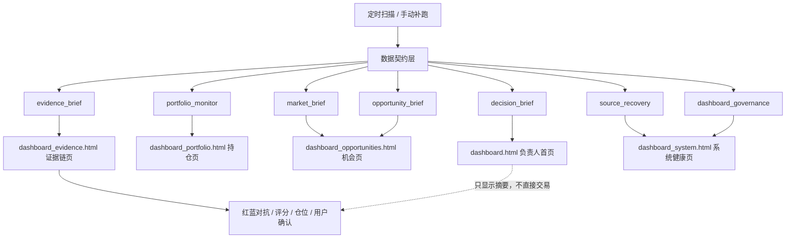

# Dashboard 信息架构目标图

> 日期：2026-05-26  
> 目标：把投研 Dashboard 拆成“负责人首页 + 四个专业子页”，让用户打开首页先看结论，不被系统日志淹没。

## 1. 总体结构

```text
dashboard.html
  顶部状态条
  投研总摘要
  持仓风险总览
  红蓝门控状态 Stepper
  今日 Top 3 Watch / 今日唯一焦点
  数据可信度摘要
  去看：持仓 / 机会 / 证据链 / 系统健康

dashboard_portfolio.html
  账户权益
  持仓风险
  当前价格 / 浮盈亏
  持仓事件
  板块联动
  止损 / 失效条件 / 最大亏损缺口

dashboard_opportunities.html
  市场结构
  主题热度
  深评候选
  候选图表
  催化剂时间轴
  可进入红蓝 / 等承接 / 缺证据分组

dashboard_evidence.html
  CIO 总审
  子 Agent memo
  阻断归因：事实 → 推理 → 结论
  红蓝预审
  证据包链接

dashboard_system.html
  source health
  recovery plan
  自动化 / 补跑
  数据源连续失败统计
  Dashboard 产品审核
  工程诊断
```

## 2. 首页一屏顺序

### 0）顶部状态条

顶部固定展示今日总判定、数据可信度、当前持仓、门控状态和只读安全边界。这里是“能不能信、能不能动”的第一眼答案。

### 1）投研总摘要

首页第一卡，整合每日 AI 市场总结、当前持仓风险、重要事项 Top 3、AI 多维评级、CIO 状态、红蓝结论、评分卡/仓位/用户确认状态和今日下一步。它只引用上游结论，不替代 CIO、红蓝或评分卡。

### 2）持仓风险总览

有持仓时强制出现，并排在第二位。

字段：

- 账户权益；
- 持仓列表；
- 成本暴露；
- 最新价 / 市值 / 浮盈亏：没有就标 `待刷新`；
- 今日持仓事件；
- 风险缺口：止损、失效条件、最大亏损、价格源。

### 3）今日总判定

- 只显示一句主结论：`可读 / 降权可读 / 不足以交易 / 阻断`。
- 必须显示 as_of。
- 必须显示“不能交易的原因”而不是只写状态。

### 4）今日 AI 投研摘要 / 多维评级

格式固定：

```text
事实：...
推理：...
结论：...
缺口/下一步：...
```

### 4.5）红蓝门控状态 Stepper

固定展示：

```text
证据 → 红蓝 → 评分 → 仓位 → 用户确认
```

红蓝对抗保持现有蓝队、红队、仲裁和 scoring-card，不升级成 TradingAgents 式群聊辩论。若持仓价格、公告、风险缺口或 source health 未就绪，Stepper 停在“证据待补齐”。

## 2.1 当前实现状态（2026-05-26）

当前 `scripts/render_dashboard.py` 已按本信息架构落地：

- 首页：`dashboard.html`
- 持仓页：`dashboard_portfolio.html`
- 机会页：`dashboard_opportunities.html`
- 证据链页：`dashboard_evidence.html`
- 系统健康页：`dashboard_system.html`

首页不再承载所有细节。`CIO 总审 / 30秒阅读路径 / 阻断归因矩阵 / 数据降权与补跑策略 / Dashboard 产品审核摘要` 允许在子页完整展示；首页必须提供清晰入口。

AI 摘要优先级：

```text
持仓风险 > 市场状态 > 新机会 > 证据缺口 > 系统诊断
```

### 5）今日最该盯 3 件事

每条必须包含：

- 事项；
- 为什么重要；
- 触发条件；
- 来源；
- 下一次刷新。

### 5）市场状态一句话

例：

```text
短期 risk-on 但事件风险偏高；高位主题只能等承接，不自动进入交易。
```

### 6）机会摘要

只显示摘要，不显示大表：

- 可读候选数量；
- 等承接候选；
- 缺证据候选；
- 今日可进入红蓝数量；
- 链接到机会页。

### 7）数据可信度摘要

只显示：

- usable / degraded / unavailable；
- 降级源数量；
- 影响范围；
- 下一次重试；
- 是否需要 AI 诊断。

## 3. 子页职责

### `dashboard_portfolio.html`

这是用户已有仓位的工作台。它必须比新机会更优先。

组件：

1. 账户权益与现金；
2. 持仓成本、当前价、市值、浮盈亏；
3. 成本暴露与单标的集中度；
4. 持仓相关新闻/公告/事件；
5. 持仓所属行业/主题联动；
6. 风险边界：止损、失效条件、最大亏损；
7. 数据缺口：价格源、公告源、fund/LOF 溢价折价、QDII 净值滞后。

### `dashboard_opportunities.html`

这是候选发现页，不是交易页。

组件：

1. 市场结构；
2. 主题热度；
3. 深评候选；
4. 价格位置；
5. 催化剂时间轴；
6. 分组：`可进入红蓝 / 等承接 / 缺证据 / 阻断`；
7. 候选证据链接。

### `dashboard_evidence.html`

这是审查页。

组件：

1. CIO 总审；
2. 子 Agent 完成数；
3. fatal objection；
4. missing evidence；
5. 红蓝预审状态；
6. evidence pack 链接；
7. 事实 → 推理 → 结论矩阵。

### `dashboard_system.html`

这是技术和数据页。

组件：

1. Source health；
2. Recovery plan；
3. 连续失败与新鲜度；
4. 自动化任务；
5. 补跑状态；
6. Dashboard Governance；
7. 工程诊断。

## 4. 当前内容迁移规则

| 当前内容 | 目标位置 | 处理 |
|---|---|---|
| 今日总判定 | 首页 | 保留，放第一位 |
| 当前持仓 / 成本暴露 | 首页 + 持仓页 | 首页摘要，持仓页展开 |
| CIO 总审 | 首页摘要 + 证据链页 | 首页只放状态和 Top blocker |
| 子 Agent memo | 证据链页 | 首页不展开 |
| AI digest | 首页 | 改为持仓优先、事实推理结论格式 |
| 市场策略总控 | 首页一句话 + 机会页 | 首页不展开原始计划 |
| 主题热力图 | 机会页 | 首页只放 Top 3 |
| 深评候选 | 机会页 | 首页只放数量和 Top 3 |
| source health 明细 | 系统页 | 首页只放数据可信度摘要 |
| 自动化 / 补跑 | 系统页 | 首页只放异常提醒 |
| Dashboard 产品审核 | 系统页摘要 + 系统页详细 | 首页只在异常时提示 |
| 工程诊断 | 系统页折叠 | 不进入首页阅读流 |

## 5. Mermaid 目标架构图



## 6. 分阶段实现

### Phase 1：标准和审计

- 完成 `docs/dashboard-product-standard.md`；
- 完成 `docs/dashboard-data-contract.md`；
- 产品审核不再轻易给 `PASS 5.0`；
- 当前页面差距落入 research audit。

### Phase 2：数据契约

- 新增 `portfolio_monitor`；
- AI digest 改为 holdings-first；
- `source_recovery` 增加连续失败、新鲜度、下一次重试。

### Phase 3：页面拆分

- 新增持仓页和机会页；
- 首页压缩到 6-8 个卡；
- 系统健康只在系统页展开。

### Phase 4：图表和可视化

- 持仓暴露条；
- 价格/净值走势图；
- 主题热度条形图；
- 催化剂时间轴；
- 证据状态矩阵。
